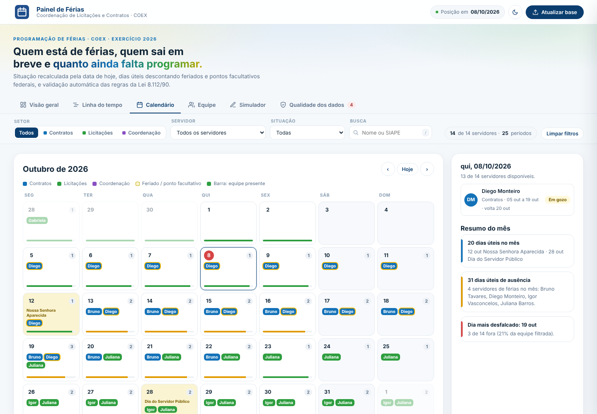

# Luis Henrique - Analytics Engineer

⚙️ Engenharia de Dados 
📊 Análise de Dados 
🎓 Análise e Desenvolvimento de Sistemas 
🗄️ Desenvolvedor de Banco de Dados (Database Developer) | DBA

"Contra dados, não há argumentos."

## 💼 Aplicando profissionalmente
- Python (análise de dados)
- Power Query
- Power BI (relatórios e dashboards)
- DAX
- HTML | CSS | JS (construção de dashboard WEB)

## 🛠️ Em aprendizado
- SQL (MySQL)
- Engenharia de Dados (conceitos e pipelines)
- Inteligência Artificial
- Inglês técnico (leitura)

## 🚀 Projetos em destaque

| Projeto | O que faz | Tecnologias | Link |
|---|---|---|---|
| **Portfólio LH Dados** | Site pessoal com experiência, projetos e certificações | HTML · CSS · JavaScript · Vercel | [site](https://portifolio-lh-dados.vercel.app) · [repositório](https://github.com/lui5henrique/portifolio-LH-dados) |
| **Painel de Férias** (demo com dados fictícios) | Transforma a planilha de férias de uma coordenação em painel gerencial: visão geral, linha do tempo por setor (Gantt), calendário, simulador com dias úteis e feriados e auditoria de qualidade dos dados | Python (openpyxl) · HTML · CSS · JavaScript · Chart.js | [código da demo](https://github.com/lui5henrique/lui5henrique/tree/main/demo-painel-ferias) |
| **Veredário** | Devocional digital de 365 dias: app que funciona offline (PWA), PDFs gerados automaticamente e páginas de venda | Python · Playwright · HTML · CSS · JavaScript · Cloudflare Workers | [página do produto](https://lp-veredario.luisaraujo-database.workers.dev) |

**Painel de Férias: calendário** (nomes e números fictícios)

## 📌 Objetivo
Colaborar com projetos e equipes de tecnologia, contribuindo com soluções orientadas por dados.

## 📫 Como me encontrar
- LinkedIn: https://www.linkedin.com/in/luis-henrique-data-analytics/
- E-mail: luisaraujo.database@gmail.com
- Instagram: https://www.instagram.com/_.lui5henrique/

---
